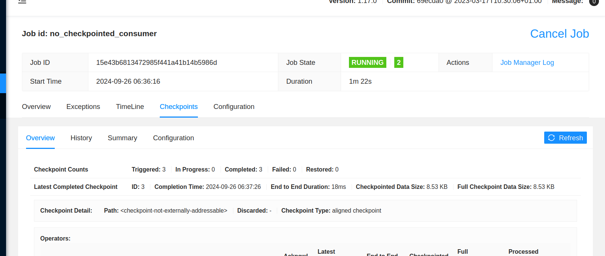

# Apache Flink - checkpoints and savepoints
 
1. Explain the [visits_window_processor_with_retained_checkpoint.py](job/visits_window_processor_with_retained_checkpoint.py) 
* the job creates tumbling windows for the visits and writes them to a file
* it retains the checkpoint when the job stops

2. Explain [visits_window_processor_without_retained_checkpoint.py](job/visits_window_processor_without_retained_checkpoint.py)
* the business logic is the same but the difference relies on the checkpoint that is not preserved after the job termination


3. Since in this demo we're going to run our jobs on a small Apache Flink cluster, let's start the Docker images:
```
cd docker/
docker-compose down --volumes; docker-compose up
```

4. Start Kafka console producer:
```
docker exec -ti wfc_kafka kafka-console-producer.sh --broker-list localhost:9092 --topic visits
```

5. Start Kafka console consumer:
```
docker exec -ti wfc_kafka kafka-console-consumer.sh --bootstrap-server localhost:9092 --topic visit-windows --from-beginning
```

## Job without the checkpoint retention

1. Connect to the Job Manager container and submit the job without the checkpoints enabled:
```
docker exec -ti docker_jobmanager_1 bash
./bin/flink run -pyclientexec /usr/bin/python3 -pyexec /usr/bin/python3 -pyfs /opt/flink/usrlib/job/ \
  -py /opt/flink/usrlib/job/visits_window_processor_without_retained_checkpoint.py 
```

2. Go to [Flink UI](http://localhost:8081) and check if the job is running. 


3. Produce some data in the Kafka console producer:
```
{"visit_id": 1, "page": "home.html", "event_time": "2024-09-06T10:06:00.000+00:00"}
{"visit_id": 1, "page": "about.html", "event_time": "2024-09-06T10:06:00.000+00:00"}
{"visit_id": 1, "page": "index.html", "event_time": "2024-09-06T10:06:00.000+00:00"}
{"visit_id": 1, "page": "main.html", "event_time": "2024-09-06T10:06:00.000+00:00"}
```

4. The consumer should return:
```
>> VISIT1, range=[2024-09-06T10:06:00 to 2024-09-06T10:07:00], visits=4
```

5. Wait for few checkpoints to be performed on Flink UI.



6. Cancel the job:


7. Return to the Job Manager container and restart the job:
```
./bin/flink run -pyclientexec /usr/bin/python3 -pyexec /usr/bin/python3 -pyfs /opt/flink/usrlib/job/ \
  -py /opt/flink/usrlib/job/visits_window_processor_without_retained_checkpoint.py 
```

8. Return to the Kafka console consumer. You should see the same window generated again:
```
>> VISIT1, range=[2024-09-06T10:06:00 to 2024-09-06T10:07:00], visits=4
```

## Job without the checkpoint retention - savepoint demo

1. Return to the Job Manager container and stop the job with created savepoint create a savepoint:
```
export JOB_ID=d92ffab3b432c1178cce6d112a9201b7 #...put your job id here
./bin/flink stop --savepointPath /checkpoints_flink $JOB_ID
```

The command should generate the following output:
```
Suspending job "d92ffab3b432c1178cce6d112a9201b7" with a CANONICAL savepoint.
Savepoint completed. Path: file:/checkpoints_flink/savepoint-d92ffa-19a6b7dc3dd6
```

2. Restart the job by referencing the savepoint:
```
# d92ffab3b432c1178cce6d112a9201b7 is the job id
ls /checkpoints_flink/

savepoint-d92ffa-19a6b7dc3dd6

# export here your checkpoint file
export SAVEPOINT_FILE=/checkpoints_flink/savepoint-d92ffa-19a6b7dc3dd6

./bin/flink run -pyclientexec /usr/bin/python3 -pyexec /usr/bin/python3 -pyfs /opt/flink/usrlib/job/ \
  -py /opt/flink/usrlib/job/visits_window_processor_without_retained_checkpoint.py -s file://$SAVEPOINT_FILE 
```

3. Check if there is no duplicates in the Kafka console consumer. You shouldn't see any new line produced.

4. Let's add some new data in the Kafka producer:
```
{"visit_id": 1, "page": "home.html", "event_time": "2024-09-06T10:06:05.000+00:00"}
{"visit_id": 1, "page": "about.html", "event_time": "2024-09-06T10:06:05.000+00:00"}
{"visit_id": 1, "page": "index.html", "event_time": "2024-09-06T10:06:05.000+00:00"}
{"visit_id": 1, "page": "main.html", "event_time": "2024-09-06T10:06:05.000+00:00"}
```

5. The consumer should increment the counter for the job restored from the savepoint:
```
>> VISIT1, range=[2024-09-06T10:06:00 to 2024-09-06T10:07:00], visits=8
```

## Job with the checkpoint retention 

1. Restart the Docker containers:
```
cd docker/
docker-compose down --volumes; docker-compose up
```

2. Start Kafka producer:
```
docker exec -ti wfc_kafka kafka-console-producer.sh --broker-list localhost:9092 --topic visits
```

3. Start Kafka consumer:
```
docker exec -ti wfc_kafka kafka-console-consumer.sh --bootstrap-server localhost:9092 --topic visit-windows --from-beginning
```

4. Start the job with the checkpoint location configured:
```
docker exec -ti docker_jobmanager_1 bash

./bin/flink run -pyclientexec /usr/bin/python3 -pyexec /usr/bin/python3 -pyfs /opt/flink/usrlib/job/ \
  -py /opt/flink/usrlib/job/visits_window_processor_with_retained_checkpoint.py -Dstate.checkpoints.dir="file:///checkpoints_flink"
```

5. Produce some data:
```
{"visit_id": 1, "page": "home.html", "event_time": "2024-09-06T10:06:15.000+00:00"}
{"visit_id": 1, "page": "about.html", "event_time": "2024-09-06T10:06:15.000+00:00"}
{"visit_id": 1, "page": "index.html", "event_time": "2024-09-06T10:06:15.000+00:00"}
{"visit_id": 1, "page": "main.html", "event_time": "2024-09-06T10:06:15.000+00:00"}
```

6. The consumer should print the first window:
```
>> VISIT1, range=[2024-09-06T10:06:00 to 2024-09-06T10:07:00], visits=4
```

6. Ensure the checkpoint was created on Flink UI:


7. Stop the job from Flink UI.

8. Restart the job by referencing the checkpoint:
```
# 7aab695f364cf5fd4ac57905ddc021e4 is the job id
ls /checkpoints_flink/7aab695f364cf5fd4ac57905ddc021e4

chk-2  shared  taskowned

# export here your checkpoint file
export CHECKPOINT_FILE=/checkpoints_flink/7aab695f364cf5fd4ac57905ddc021e4/chk-2

./bin/flink run -pyclientexec /usr/bin/python3 -pyexec /usr/bin/python3 -pyfs /opt/flink/usrlib/job/ \
  -py /opt/flink/usrlib/job/visits_window_processor_with_retained_checkpoint.py -s file://$CHECKPOINT_FILE -Dstate.checkpoints.dir="file:///checkpoints_flink"
```

9. Check the consumer's output. It shouldn't include any new window. 

10. Add some new data in the console producer:
```
{"visit_id": 1, "page": "home.html", "event_time": "2024-09-06T10:06:25.000+00:00"}
{"visit_id": 1, "page": "about.html", "event_time": "2024-09-06T10:06:25.000+00:00"}
{"visit_id": 1, "page": "index.html", "event_time": "2024-09-06T10:06:25.000+00:00"}
{"visit_id": 1, "page": "main.html", "event_time": "2024-09-06T10:06:25.000+00:00"}
```

11. The consumer should correctly increase the window's size by printing only the new count of 8:
```
>> VISIT1, range=[2024-09-06T10:06:00 to 2024-09-06T10:07:00], visits=8
```