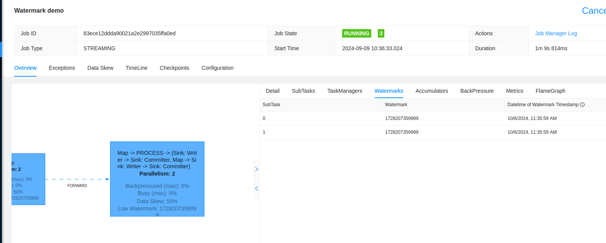

# Apache Flink - watermark
 
1. Explain the [visits_synchronizer_with_late_data_side_output.py](visits_synchronizer_with_late_data_side_output.py)
* the job processes records from _visits_ topic and classifies each visit:
  * if the visit is late, hence it's older than the current watermark, the record goes to _visits-late_ topic
  * otherwise, the visit is considered as on-time and goes to the _visits-on-time_ topic
* watermark is configured as allowing disordering for up to 30 minutes: 
`WatermarkStrategy.for_bounded_out_of_orderness(Duration.of_minutes(30)`
* to see the watermark advancing on Flink UI, the job also disables operator chaining to show each task separately,
thus be able to display the watermarks after the Source operator

2. Start the Docker images:
```
cd docker
docker-compose down --volumes; docker-compose up
```

3. Run `visits_synchronizer_with_late_data_side_output.py`. 

4. Start two Apache Kafka consumers, one in each tab:
```
docker exec -ti wfc_kafka kafka-console-consumer.sh --bootstrap-server localhost:9092 --topic visits-on-time --from-beginning

docker exec -ti wfc_kafka kafka-console-consumer.sh --bootstrap-server localhost:9092 --topic visits-late --from-beginning
```

5. Open an Apache Kafka console producer:
```
docker exec -ti wfc_kafka kafka-console-producer.sh --broker-list localhost:9092 --topic visits --property parse.key=true --property key.separator==

```

6. Open Apache Flink UI at [http://localhost:4646](http://localhost:4646)) go to the "Watermarks" tab:


7. Produce the first two records:
```
a={"userId": 1, "page": "index.html", "event_time": "2024-10-06T10:00:00.000+00:00"}
b={"userId": 2, "page": "index.html", "event_time": "2024-10-06T10:03:00.000+00:00"}
c={"userId": 3, "page": "index.html", "event_time": "2024-10-06T10:06:00.000+00:00"}
d={"userId": 4, "page": "index.html", "event_time": "2024-10-06T10:06:00.000+00:00"}
```

The on-time consumer should process those records:
```
{"visit_stringified": "{\"userId\": 1, \"page\": \"index.html\", \"event_time\": \"2024-10-06T10:00:00.000+00:00\"}", "processing_time_seconds": "2024-09-09T06:37:28+00:00"}
{"visit_stringified": "{\"userId\": 2, \"page\": \"index.html\", \"event_time\": \"2024-10-06T10:03:00.000+00:00\"}", "processing_time_seconds": "2024-09-09T06:37:28+00:00"}
{"visit_stringified": "{\"userId\": 4, \"page\": \"index.html\", \"event_time\": \"2024-10-06T10:06:00.000+00:00\"}", "processing_time_seconds": "2024-09-09T06:37:28+00:00"}
{"visit_stringified": "{\"userId\": 3, \"page\": \"index.html\", \"event_time\": \"2024-10-06T10:06:00.000+00:00\"}", "processing_time_seconds": "2024-09-09T06:37:28+00:00"}
```

Flink UI should have the watermark updated:



⚠️ The UI displays watermarks with the local timezone.


8. Let's produce now a late record within the watermark and one late record before the watermark. The watermark at this moment
is 09:36 meaning that any records at or after this time will be accepted:
```
a={"userId": 222, "page": "old_index.html", "event_time": "2024-10-06T09:36:00.000+00:00"} 
z={"userId": 22, "page": "old_index.html", "event_time": "2024-10-06T09:35:00.000+00:00"} 
```

Now, you should see one extra record in the on-time topic...:
```
{"visit_stringified": "{\"userId\": 222, \"page\": \"old_index.html\", \"event_time\": \"2024-10-06T09:36:00.000+00:00\"} ", "processing_time_seconds": "2024-09-09T06:38:04+00:00"}
```

and another in the late topic:
```
{"visit_stringified": "{\"userId\": 22, \"page\": \"old_index.html\", \"event_time\": \"2024-10-06T09:35:00.000+00:00\"} ", "processing_time_seconds": "2024-09-09T06:38:04+00:00", "latency": 59999}
```

9. Let's move the watermark on by sending two new records:
```
a={"userId": 1, "page": "index.html", "event_time": "2024-10-06T10:40:00.000+00:00"}
b={"userId": 2, "page": "index.html", "event_time": "2024-10-06T10:43:00.000+00:00"}
c={"userId": 3, "page": "index.html", "event_time": "2024-10-06T10:46:00.000+00:00"}
d={"userId": 4, "page": "index.html", "event_time": "2024-10-06T10:46:00.000+00:00"}
```

The on-time topic should get extra records:
```
{"visit_stringified": "{\"userId\": 1, \"page\": \"index.html\", \"event_time\": \"2024-10-06T10:40:00.000+00:00\"}", "processing_time_seconds": "2024-09-09T06:39:11+00:00"}
{"visit_stringified": "{\"userId\": 2, \"page\": \"index.html\", \"event_time\": \"2024-10-06T10:43:00.000+00:00\"}", "processing_time_seconds": "2024-09-09T06:39:11+00:00"}
{"visit_stringified": "{\"userId\": 3, \"page\": \"index.html\", \"event_time\": \"2024-10-06T10:46:00.000+00:00\"}", "processing_time_seconds": "2024-09-09T06:39:11+00:00"}
{"visit_stringified": "{\"userId\": 4, \"page\": \"index.html\", \"event_time\": \"2024-10-06T10:46:00.000+00:00\"}", "processing_time_seconds": "2024-09-09T06:39:13+00:00"}
```

Flink UI should show the updated watermark:


