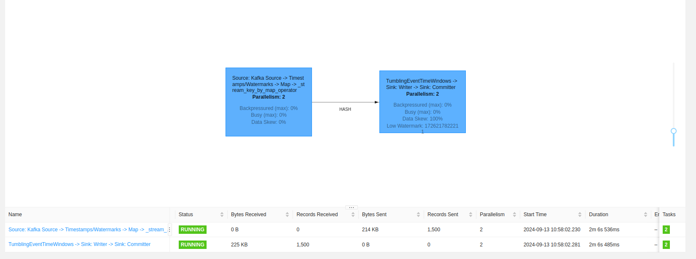
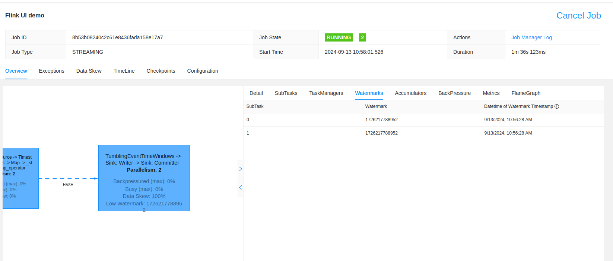
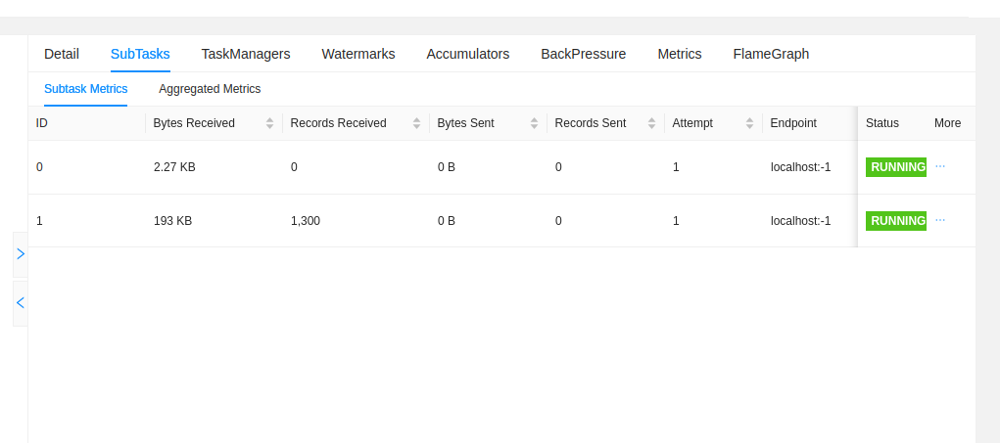
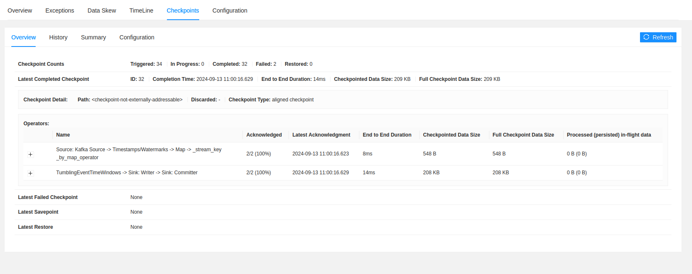

# Apache Flink - Flink UI

1. Start Docker containers:
```
cd docker
docker-compose down --volumes; docker-compose up
```

2. Explain the [visits_counter_job.py](visits_counter_job.py)
* the job counts the number of visits for each browser for 5-minutes event-time windows

3. Start `visits_counter_job.py`

4. Open Flink UI at [http://localhost:4646/#/overview](http://localhost:4646/#/overview)

5. The welcome page shows all the jobs running on our local cluster. For the demo we have only one job called 
"Flink UI demo". You can click on it to see the details.

6. First, let's get the overview, thus the processing flow with all summary statistics per task. 




If there is any backpressure, i.e. downstream operators are consuming data slower than the upstream operators 
are generating it.

7. Let's see now some important concepts. The first is the watermark. As you know, it helps determining how late data can be
and how long a state will be stored for a stateful entity. A task have a dedicated tab called "Watermark" where you can see
how each watermark moves on:



8. Also, at the task level, you can get a more detailed information about the subtasks, a little bit like in Apache Spark 
you can get detailed information about the tasks that are located within a stage. In our case, we can clearly see
the input and output rate, alongside the number of retries:



9. Besides the watermark, there is also a dedicated tab to the "Checkpoints", this time at the "Job" level directly:



You can find there the stats for the total number of checkpoints with the breakdown to the completed and failed actions.

10. The last nice feature that should help you start is the "Job Manager" menu and the metrics view where you can get a 
clear representation of your memory pressure