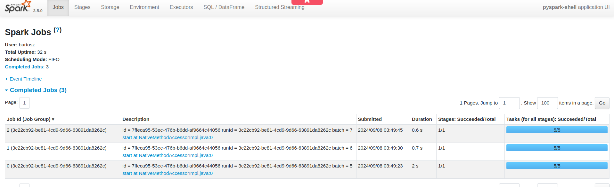
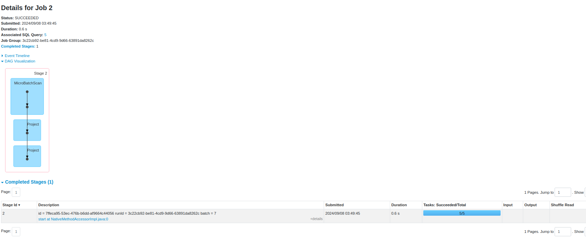

# Apache Spark Structured Streaming - Apache Kafka data source and data sink

1. Explain [kafka_to_kafka_writer.py](kafka_to_kafka_writer.py)
* the code selects a few attributes from the initial input row and sends them to visits-a or visits-b topic
* this demo shows an interesting feature of Apache Kafka sink which is a custom topic; put differently, if the 
`DataFrame` has a _topic_ column, the Kafka sink will use this value as the output destination
  * in our case, if the _page_ column starts with "category", the record goes to the visits-a, otherwise it'll land in
  visits-b topic
* another feature we're going to see is `minPartitions`; by default Apache Spark will read each Kafka partition in a 
dedicated task. With the minPartitions customized, there will be more readers than partitions and it should help 
in increasing a better throughput
* of course, a custom topic is not the single feature of Apache Kafka, all are greatly explained in the documentation
at [https://spark.apache.org/docs/3.5.0/structured-streaming-kafka-integration.html](https://spark.apache.org/docs/3.5.0/structured-streaming-kafka-integration.html)


2. Start the Docker images with the visits data generator:
```
cd docker
docker-compose down --volumes; docker-compose up
```

3. Start the `kafka_to_kafka_writer.py`

4. Open Spark UI at [http://localhost:4040](http://localhost:4040). The input topic has 2 partitions but you can notice
5 tasks for each job:




5. See the data in the two topics:

_visits-a_
```
docker exec wfc_kafka kafka-console-consumer.sh --topic visits-a --bootstrap-server localhost:9092 --from-beginning
{"visit_id":"140497993558912_4","event_time":"2024-01-01T00:03:00.000Z","page":"category_18"}
{"visit_id":"140497993558912_8","event_time":"2024-01-01T00:00:00.000Z","page":"category_5"}
{"visit_id":"140497993558912_4","event_time":"2024-01-01T00:08:00.000Z","page":"category_11"}
{"visit_id":"140497993558912_7","event_time":"2024-01-01T00:09:00.000Z","page":"category_14"}
{"visit_id":"140497993558912_5","event_time":"2024-01-01T00:19:00.000Z","page":"category_9"}
{"visit_id":"140497993558912_6","event_time":"2024-01-01T00:19:00.000Z","page":"category_1"}
{"visit_id":"140497993558912_2","event_time":"2024-01-01T00:10:00.000Z","page":"category_18"}
{"visit_id":"140497993558912_5","event_time":"2024-01-01T00:25:00.000Z","page":"category_13"}
{"visit_id":"140497993558912_7","event_time":"2024-01-01T00:18:00.000Z","page":"category_20"}
{"visit_id":"140497993558912_0","event_time":"2024-01-01T00:07:00.000Z","page":"category_11"}
{"visit_id":"140497993558912_0","event_time":"2024-01-01T00:12:00.000Z","page":"category_7"}
{"visit_id":"140497993558912_2","event_time":"2024-01-01T00:16:00.000Z","page":"category_5"}
{"visit_id":"140497993558912_0","event_time":"2024-01-01T00:20:00.000Z","page":"category_14"}
{"visit_id":"140497993558912_1","event_time":"2024-01-01T00:23:00.000Z","page":"category_10"}
{"visit_id":"140497993558912_3","event_time":"2024-01-01T00:18:00.000Z","page":"category_9"}
{"visit_id":"140497993558912_0","event_time":"2024-01-01T00:24:00.000Z","page":"category_2"}
{"visit_id":"140497993558912_5","event_time":"2024-01-01T00:38:00.000Z","page":"category_20"}
...
```

_visits-b_
```
docker exec wfc_kafka kafka-console-consumer.sh --topic visits-b --bootstrap-server localhost:9092 --from-beginning
{"visit_id":"140497993558912_4","event_time":"2024-01-01T00:00:00.000Z","page":"index"}
{"visit_id":"140497993558912_0","event_time":"2024-01-01T00:00:00.000Z","page":"about"}
{"visit_id":"140497993558912_1","event_time":"2024-01-01T00:00:00.000Z","page":"page_16"}
{"visit_id":"140497993558912_5","event_time":"2024-01-01T00:00:00.000Z","page":"contact"}
{"visit_id":"140497993558912_2","event_time":"2024-01-01T00:00:00.000Z","page":"about"}
{"visit_id":"140497993558912_6","event_time":"2024-01-01T00:00:00.000Z","page":"page_7"}
{"visit_id":"140497993558912_3","event_time":"2024-01-01T00:00:00.000Z","page":"home"}
{"visit_id":"140497993558912_7","event_time":"2024-01-01T00:00:00.000Z","page":"contact"}
{"visit_id":"140497993558912_5","event_time":"2024-01-01T00:03:00.000Z","page":"home"}
{"visit_id":"140497993558912_6","event_time":"2024-01-01T00:05:00.000Z","page":"about"}
{"visit_id":"140497993558912_9","event_time":"2024-01-01T00:00:00.000Z","page":"categories"}
{"visit_id":"140497993558912_7","event_time":"2024-01-01T00:04:00.000Z","page":"home"}
{"visit_id":"140497993558912_4","event_time":"2024-01-01T00:05:00.000Z","page":"categories"}
{"visit_id":"140497993558912_0","event_time":"2024-01-01T00:02:00.000Z","page":"main"}
{"visit_id":"140497993558912_5","event_time":"2024-01-01T00:08:00.000Z","page":"page_4"}
...
```