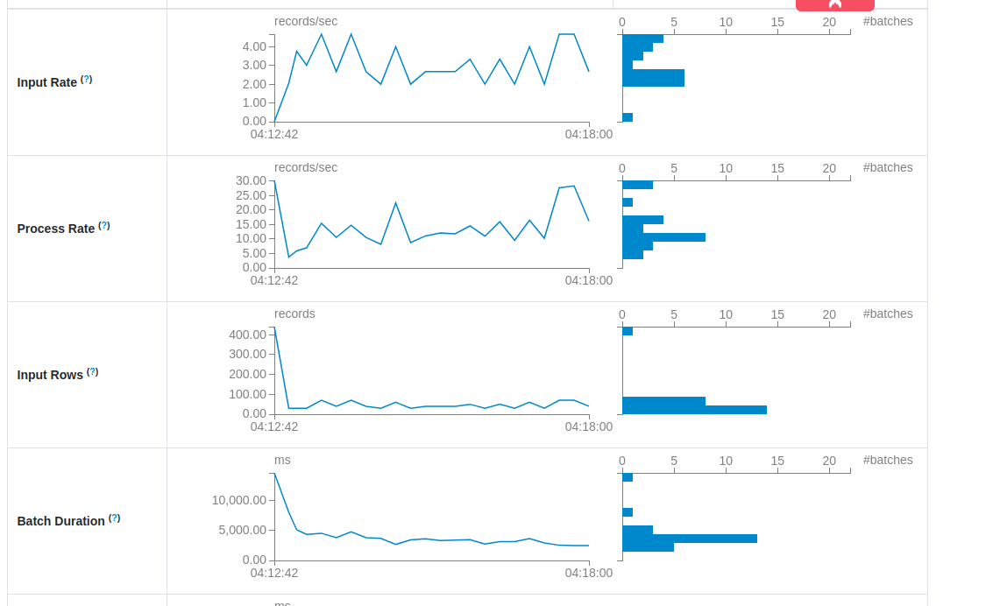
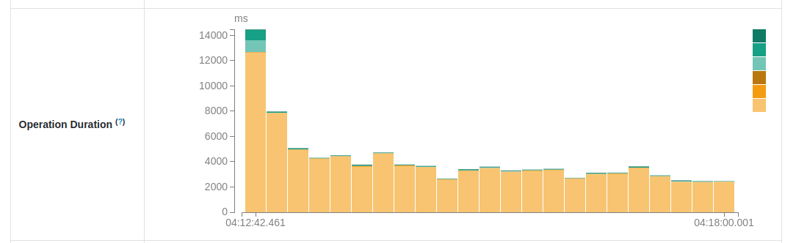
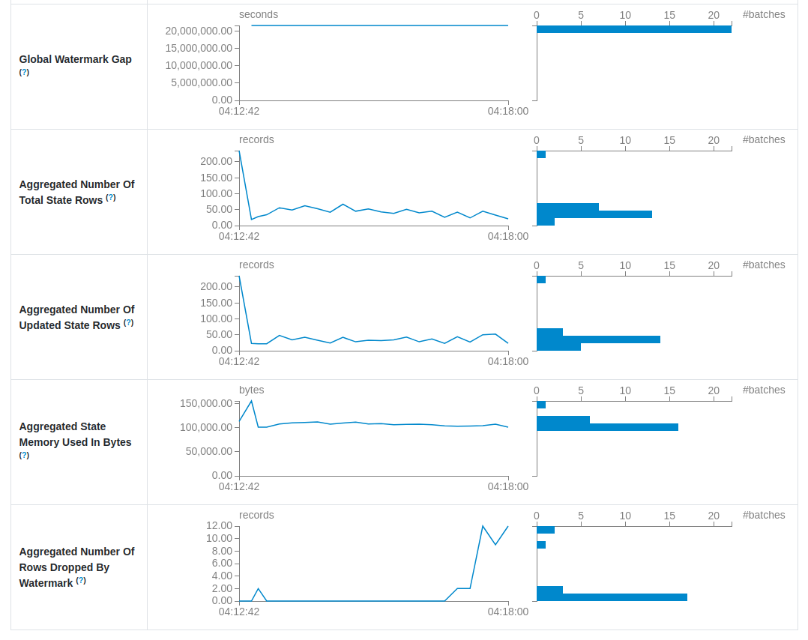
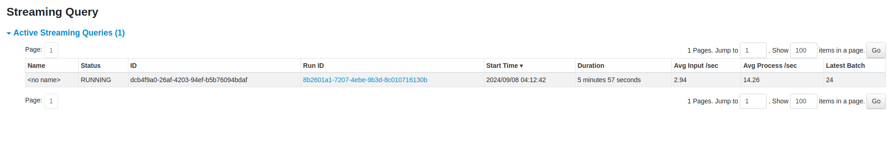
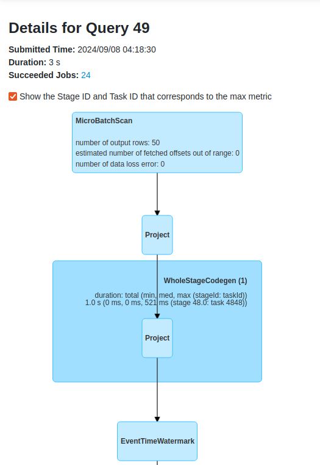
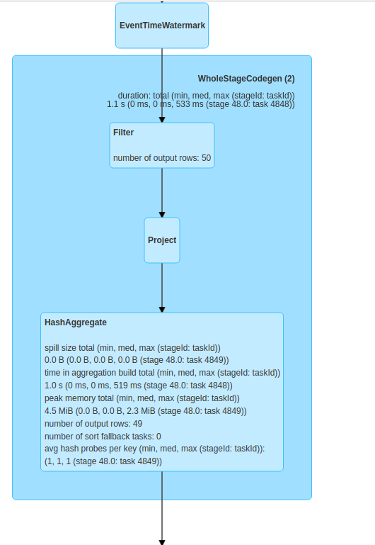
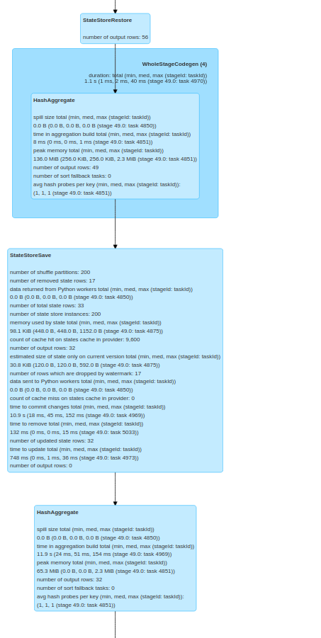

# Apache Spark Structured Streaming - Spark UI
 
1. In this demo we're going to see all Structured Streaming-related UI aspects. For that, we'll run
the [page_stats_generation_stateful_job.py](page_stats_generation_stateful_job.py)
similar to the browser stats from the [03-staless-vs-stateful-processing](../03-staless-vs-stateful-processing). The 
single difference is the adaptation to the data-generator and usage of page instead of the browser for the aggregation.

2. Start the Docker images with the visits data generator:
```
cd docker
docker-compose down --volumes; docker-compose up
```

3. Run `page_stats_generation_stateful_job.py`. 

4. Go to Spark UI at [http://localhost:4040](http://localhost:4040). Wait 5 minutes to see some progress with the job:

**Micro-batches**



Here you can see how your micro-batches have been performing so far. You can then see that our processing time is 
relatively constant. The exception is the first micro-batch because it processes all data generated so far, i.e. it 
runs a bit like it was in a backfill mode and not the near real-time processing. It's proven by the _Input Rows_ diagram
where you can see almost 4x more records.

**Micro-batch zoom**



Here you can see the history of your micro-batch, i.e. how particular steps of each micro-batch have been running.
As expected, the first micro-batch took more time to prepare the processing metadata because of the initialization work. 
The next steps were more balanced and again, according to our expectations, the micro-batches spent most of their 
up time on the data processing.

**State store**



As we're running a stateful job, we also can access to the state metrics. You can see that with time the number of state
rows were constant until the moment where fresher data started to arrive. It led to the decreased number of aggregated
and updated rows in the state store, as well as to the rows dropped by the watermark.

**Summary**



When you click on the Structured Streaming tab, you can also see a quick overview of the streaming jobs' progress.

**Query plan**





Although the query plan for Structured Streaming looks similar to the one for the batch layer, there are some different nodes.
One of them are all nodes related to the micro-batch (`MicroBatchScan`), watermark (`EventTimeWatermark`) 
and state store management (`StateStoreRestore` and `StateStoreSave`).